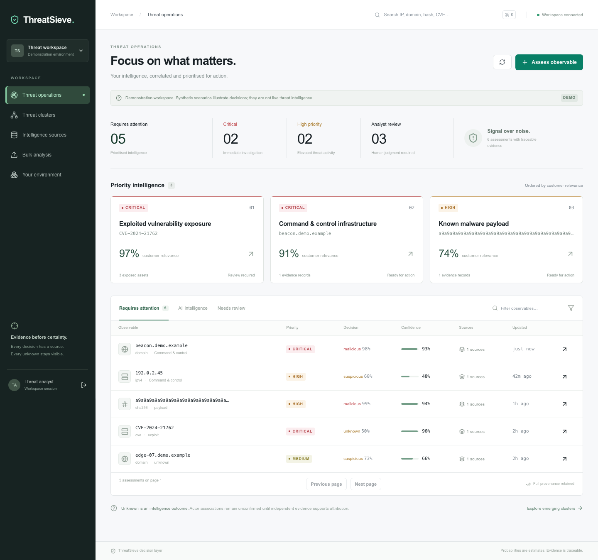
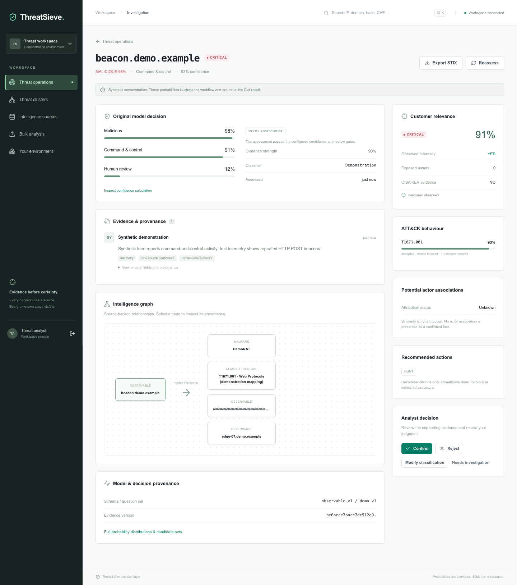
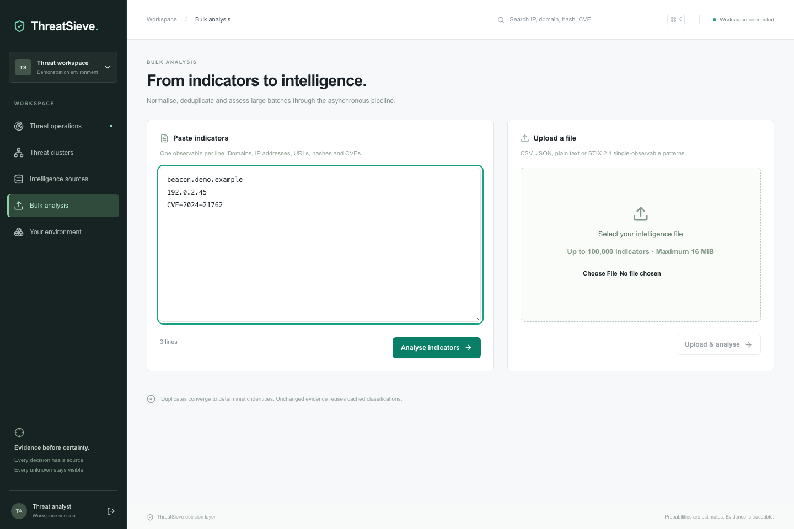
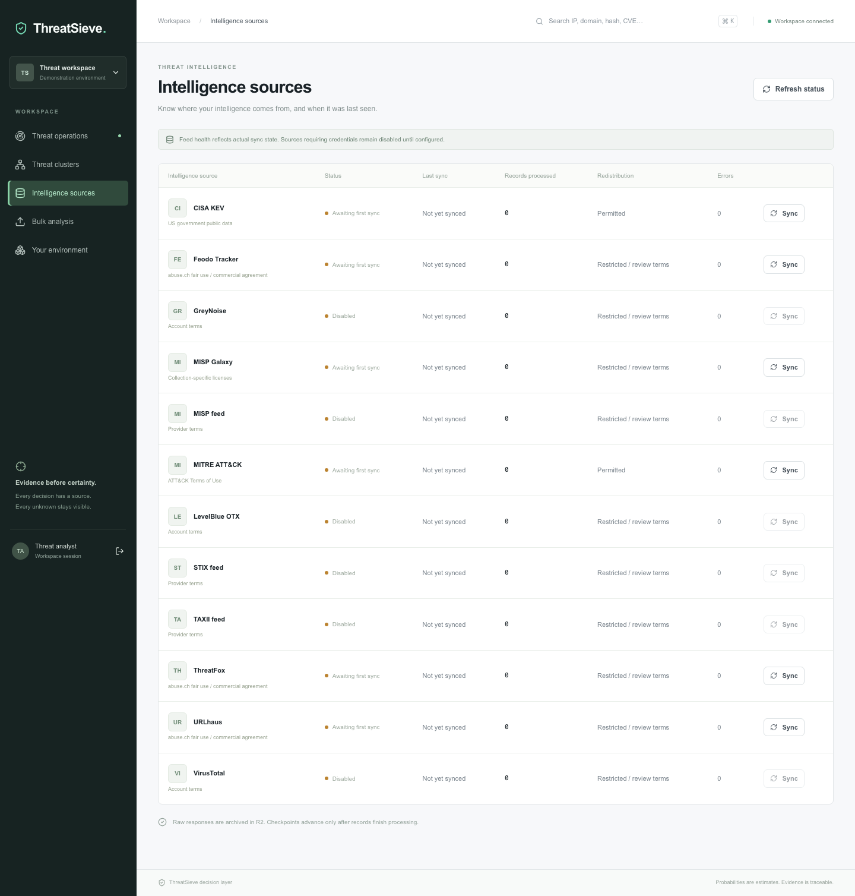
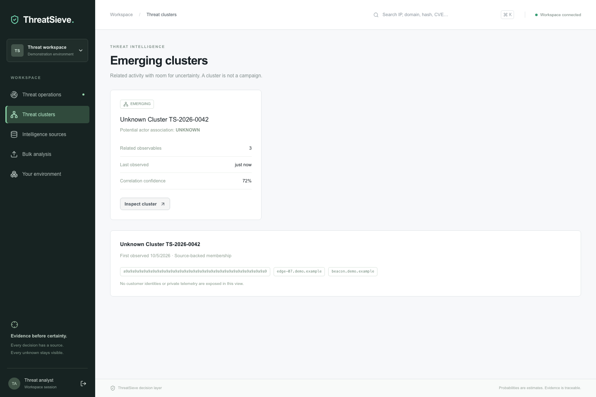
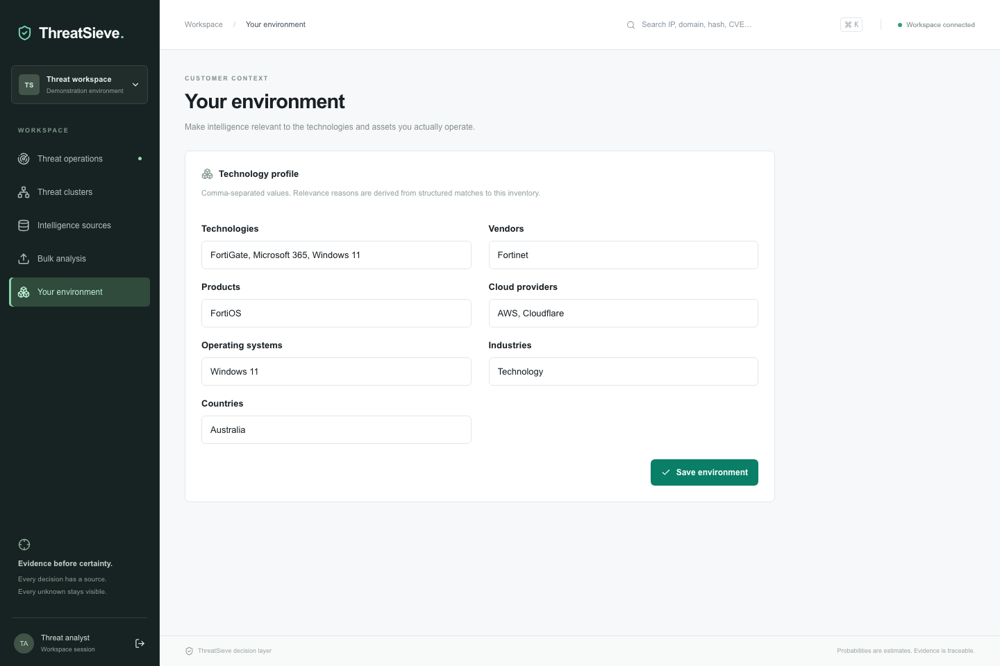
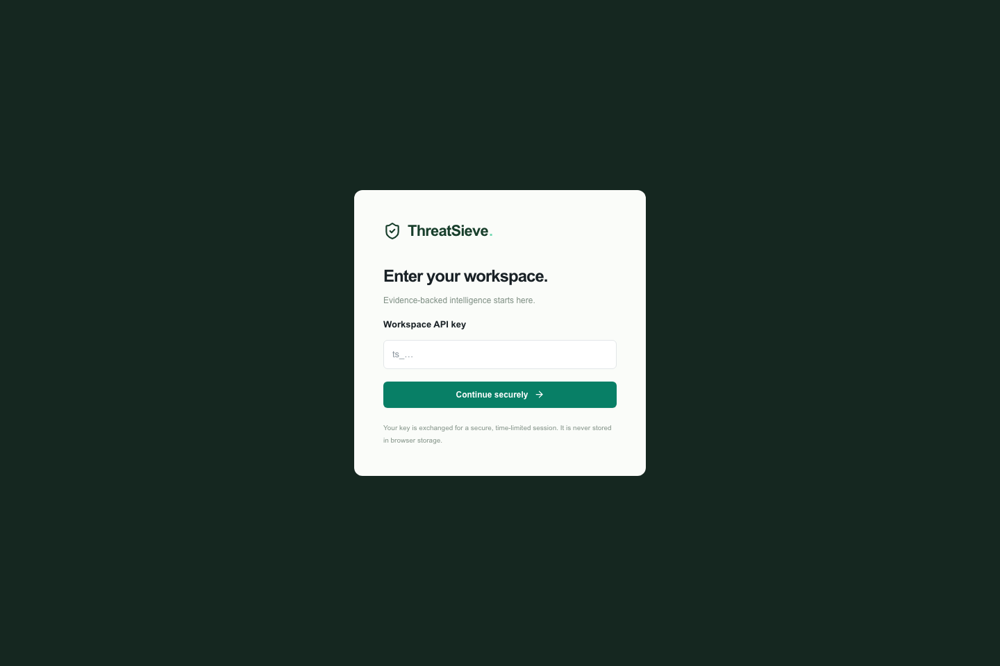
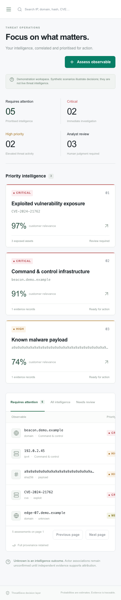
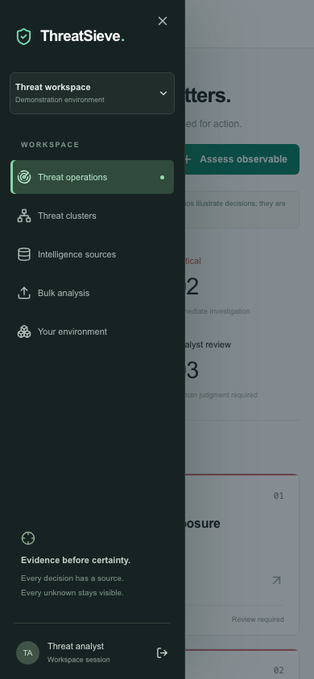

# ThreatSieve

**Turn raw threat data into evidence-backed threat decisions.**

ThreatSieve is a TypeScript-first intelligence pipeline and analyst workspace built on Cloudflare Workers, D1, R2, Queues, Workers AI and Vectorize. It uses Clef typed decisions at bounded classification points. It is not a chatbot, a generative attribution engine or a blocking system.



[View the complete screenshot gallery](#screenshots).

## Run locally

Requirements: Node.js 22.22.3+ (22.x) or 24.8+, pnpm 10, and a Cloudflare account with Workers AI access for live classification.

```sh
pnpm install
pnpm bootstrap
pnpm dev
```

Open **http://127.0.0.1:3000**. The API listens on **http://127.0.0.1:8787**. Bootstrap applies local migrations and seeds six explicitly synthetic scenarios. It creates a random local API key in `credentials.local.json` and a development-only server credential in `apps/web/.env.local`. Both files are ignored by Git. The frontend uses this credential only when `NODE_ENV=development`; production requires sign-in.

The seeded UI works without calling AI. **New assessments call real Workers AI**, including during local Wrangler development. Authenticate with `pnpm exec wrangler login` before making live assessments. There is no silent substitute for an unavailable classifier. Copy `.dev.vars.example` to `.dev.vars` and supply ThreatFox and URLhaus keys to enable those feeds. MITRE, MISP Galaxy, Feodo and CISA KEV require no application credential.

```sh
pnpm --silent cli assess example.com --json
pnpm --silent cli assess-file indicators.csv --json
pnpm --silent cli feeds sync mitre --json
pnpm --silent cli feeds sync misp --json
pnpm --silent cli feeds sync threatfox --json
pnpm --silent cli actor 'Fancy Bear' --json
pnpm --silent cli attack T1071.001 --json
```

Sync MITRE first, then MISP, then indicator feeds so canonical knowledge is available for candidate retrieval. Feed imports are asynchronous. Check source status in the UI. `example.com` with no supporting intelligence should produce an **unknown** assessment, not an invented malicious verdict.

## Implemented vertical slice

- Six required source adapters with Zod validation, deterministic identities, source provenance and R2 archival.
- D1 graph storage, actor aliases, bounded graph candidates and optional Vectorize retrieval.
- Clef-flash → confidence gate → Clef escalation. Full question distributions and candidate sets are retained.
- Behaviour-gated ATT&CK mappings, conservative actor associations, structured confidence factors and customer relevance.
- Scoped API keys, expiring web sessions, tenant-filtered private data, rate limits and audit events.
- Analyst operations, search, investigation, evidence inspection, clickable graph nodes, confirm/reject/modify/investigate, bulk upload, sources, clusters and environment profile.
- Asynchronous processing, D1 outbox, job leases, retry/dead-letter handling and replay.
- STIX 2.1 export and a Python OpenCTI connector using `OpenCTIConnectorHelper.send_stix2_bundle`.
- Optional provider adapters for OTX, VirusTotal, GreyNoise, TAXII, STIX and MISP; disabled unless explicitly configured.
- Offline evaluation metrics and browser/integration/security tests.

## Commands

| Command                                               | Purpose                                                          |
| ----------------------------------------------------- | ---------------------------------------------------------------- |
| `pnpm dev`                                            | API Worker and Next.js development servers                       |
| `pnpm bootstrap`                                      | Local migrations and synthetic demo seed                         |
| `pnpm test`                                           | Offline unit and D1 integration tests                            |
| `pnpm test:e2e`                                       | Isolated full-stack tests using tester-army/e2e                  |
| `pnpm lint`                                           | TypeScript/React lint checks                                     |
| `pnpm typecheck`                                      | Strict backend and frontend types                                |
| `pnpm build`                                          | Worker dry-run bundle and Next.js production build               |
| `pnpm eval`                                           | Evaluation fixture self-check; emits `artifacts/evaluation.json` |
| `pnpm security`                                       | Repository security checks                                       |
| `pnpm deploy`                                         | Configured staging deployment; see deployment guide              |
| `pnpm tenant:create 'Organisation' admin@example.com` | Provision a local tenant and one-time key                        |

For browser tests, run `pnpm exec e2e-web install chromium` once, then `pnpm test:e2e`. The suite starts its own production web build and ephemeral Workers/D1/R2/Queues environment; no bootstrap, Cloudflare login, feed credentials or model API key is needed. See [end-to-end testing](docs/e2e.md) for coverage and diagnostics. The earlier Playwright regressions remain available as `pnpm test:playwright` against the local demo (CI starts that demo automatically). Tests never use live intelligence APIs. `pnpm eval --current current.json --candidate candidate.json` compares measured predictions. Default fixture metrics are **not a claim about Clef accuracy**.

## Production deployment

See [deployment](docs/deployment.md) for resource provisioning, migration review, secrets, staging and protected production releases. The checked-in D1 identifier is local-only and the deployment script requires a real ID. Nothing deploys to a Cloudflare account merely by installing or building the project.

Commercial readiness still requires a deployment-specific review: provider redistribution agreements, measured model evaluations, customer SSO, retention policy, operational alerting, load tests and OpenCTI/Workers AI acceptance tests in the target environment. This repository provides a working MVP implementation and explicit scale/security boundaries; it does not claim those operational acceptance checks have happened automatically.

## Design constraints

Models select existing candidates and cannot create intelligence entities. An ATT&CK relationship from malware to a technique is a candidate, not proof that an indicator exhibited that behaviour. Actor similarity is not attribution. Private telemetry is tenant-scoped. Exports omit non-redistributable evidence by default. All remediation actions are recommendations.

## Screenshots

Captured from the running application with the labelled synthetic demo dataset. These images show the desktop workspace and responsive mobile layout; displayed probabilities are demonstration values.

### Investigation, evidence and intelligence graph



### Bulk analysis



### Intelligence sources



### Emerging clusters



### Customer environment



### Workspace sign-in



### Mobile operations and navigation

| Threat operations                                                                                                                            | Navigation drawer                                                                                                                |
| -------------------------------------------------------------------------------------------------------------------------------------------- | -------------------------------------------------------------------------------------------------------------------------------- |
|  |  |

## Documentation

[Architecture](docs/architecture.md) · [Threat model](docs/threat-model.md) · [Classification](docs/classification.md) · [Confidence](docs/confidence-model.md) · [Sources](docs/intelligence-sources.md) · [Data model](docs/data-model.md) · [API](docs/api.md) · [OpenCTI](docs/opencti.md) · [Deployment](docs/deployment.md) · [Commercial architecture](docs/commercial-architecture.md)
