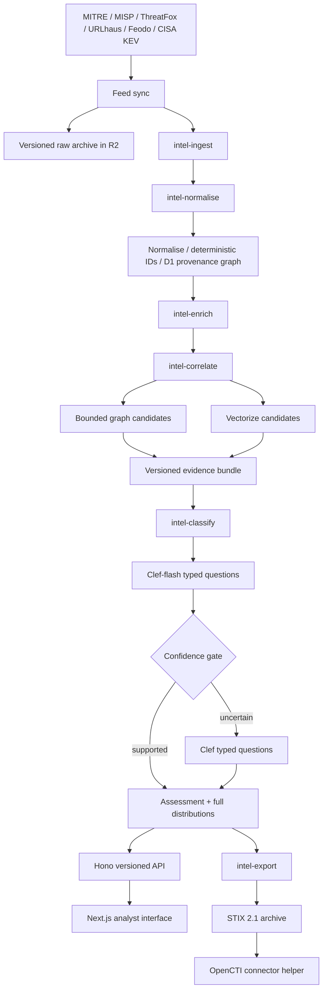
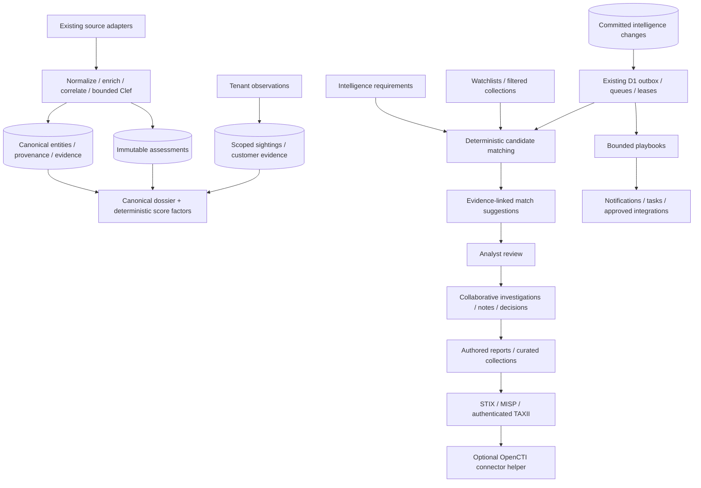

# ThreatSieve architecture

ThreatSieve reduces indicators to evidence-backed decisions. Deterministic identity, graph retrieval and policy gates surround a typed probabilistic classifier. Models cannot create entities or relationships. Unknown is an explicit outcome.

## Deployment boundary

The MVP deploys one Worker with separately addressable queue stage handlers. Sharing one artifact reduces configuration drift; stage modules can become separate Workers without changing contracts. D1 is the transactional metadata store; R2 holds raw responses and exports; Vectorize is optional candidate retrieval, never a source of facts. Queue names identify stages. No KV is needed initially.

## Isolation and reliability

Public feed entities and evidence are global. Customer observations, assessments, jobs, feedback, exports, sessions and audit events are tenant-scoped. Repository methods require a tenant for private reads. Queue jobs carry tenant scope and deterministic identifiers. A D1 outbox atomically records state changes and downstream jobs; a scheduled dispatcher retries unsent outbox entries. Leased stage execution and deterministic inserts make redelivery safe. Poison jobs become terminal and remain available for audited replay.

Evidence changes create new evidence-version hashes. Classification cache keys include tenant, entity, evidence version, question/schema version and model. Both flash and escalation responses are retained. Candidate IDs are resolved from existing graph entities and revalidated before producing mappings. ATT&CK mappings require behavioural evidence; actor associations require multiple distinct dimensions before high confidence is possible.

## Scale boundary

Queries are paginated and graph depth/node counts are bounded. Feed archives are bounded; imports fan out in small queue messages. No all-observable scans occur on the assessment path. The official ATT&CK snapshot is streamed into a multipart R2 archive (96 MiB response ceiling, 8 MiB per-object character ceiling, 50,000-object ceiling). Normalisation processes ten source records per job; snapshots are never parsed as a single JSON object in Worker memory. Classifier evidence has a 128 KiB context budget and returns an explicit error if exceeded. Split very large upstream feeds into provider-supported pages or operator-managed STIX files. D1 global graph sharding and dedicated per-tenant databases are later scale options; neither is hidden behind a claim of unlimited capacity.

## Delivery sequence

1. Shared schemas, migrations, scoped repositories, API and web shell.
2. MITRE and ThreatFox adapters, normalisation and provenance; demonstrate one complete decision path.
3. MISP aliases, remaining required feeds, candidate retrieval and conservative classification.
4. Investigation, feedback, asynchronous bulk jobs, STIX and OpenCTI.
5. Security, migration/integration tests, evaluation tooling and deployment runbook.

## Human intelligence operations

The operations package extends the existing repository and queue stages. It does not introduce a separate graph database or independent model pipeline. Collection matching, confidence factors, coverage, reporting and automation contain no generative model calls. Model-origin decisions remain explicit in existing assessments and STIX metadata.
