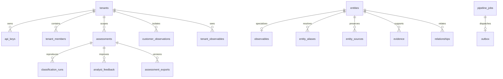

# Data model

D1 migrations are the sole schema authority. No request dynamically creates tables. Prepared statements bind external input; interpolated table names come from a closed internal enum.

Global entities store a validated typed JSON representation alongside indexed type, canonical name and external ID. Observables add a unique `(type, normalized_value)` key and deterministic SHA-256 identity. Normalisation precedes hashing. DNS names are lowercased and IDNA-normalised; hashes are lowercased; IPv6 is canonicalised; URL host/default ports are normalised without sorting query parameters or lowercasing paths. Ambiguous observables need explicit type.

Relationships retain assertion type, source/target, confidence and provenance. Source claims and model inferences are never rewritten into observed facts. Tenant analyst relationship feedback is stored separately from the shared public graph. `entity_sources` retains provenance when another feed supplies aliases for an existing entity.

Private submissions and customer observations have visibility grants in `tenant_observables`. They do not enter public search or graph results. Public feed intelligence can promote the same deterministic observable into global visibility without disclosing tenant observations. Assessment, feedback, session, export and job queries require tenant scope.

Evidence payloads are queryable JSON with an R2 raw-object reference. Arrays are bounded on the decision path. The current bundle limit is 100 public evidence records plus 30 customer records. Graph retrieval is bounded; truncated context forces review. Assessment lists use sort-aware keyset cursors. Entity search uses indexed literal prefixes of canonical names, external IDs and aliases, with visibility enforced before pagination.

Migration `0008_analyst_views.sql` adds personal saved views scoped by both tenant and user. Validated filter JSON is persisted under a unique owner/name key, with a maximum of 50 views per owner. The same additive migration indexes library browsing and assessment sorting by creation time, confidence and relevance. Entity cursors carry only an ID; its sort name is resolved through the scoped repository, keeping URLs bounded even for long observable values.

Customer technology profiles, assets and observations are tenant-specific. Explicit sharing consent is recorded on observations for future privacy-safe aggregation. No private evidence is copied into the global evidence table by the observation API.

Audit events record actor, tenant, action, correlation, time and structured data. API key hashes are SHA-256 of cryptographically random high-entropy tokens. Raw keys are returned once at creation; web sessions use separately generated expiring opaque tokens.

Migration `0005_review_and_exports.sql` adds an optimistic-concurrency revision to assessments and an immutable `assessment_exports` table keyed by tenant, assessment and revision. Existing export rows are copied without changing their IDs, cursor timestamps or archive paths; the legacy table is retained. Feedback, audit and export outbox insertion commit atomically, so a conflicting update cannot leave a partial decision history.

Better Auth maps organizations and members to `tenants` and `tenant_members`, preserving tenant boundaries. Its Drizzle adapter maps ISO date strings to Date values. `auth_sessions`, `auth_accounts`, `auth_verifications`, `auth_invitations` and `auth_rate_limits` are created by migration 0006. Membership IDs remain unique alongside the existing `(tenant_id,user_id)` key. Migration 0007 prevents removal/demotion of the final administrator atomically.

## Enterprise operations

Migrations 0009–0014 add:

- `workspace_objects`: tenant/kind/title/status/priority/owner, versioned validated payload and optimistic revision.
- `workspace_links`: typed canonical references with reverse indexes; intelligence is not copied into cases.
- `intelligence_events`: immutable before/after edits, analyst notes, decisions and matching events.
- `sightings`: tenant/observable/source/time/count/confidence plus original event ID and context.
- `source_ratings`, `tenant_source_policy`: tenant-specific source trust and inclusion.
- `workspace_matches`, `requirement_metrics`: background candidates and measured linked support.
- `workspace_notifications`, `notification_receipts`: workspace alerts and personal read state.
- `intelligence_changes`: durable commit-triggered change records, dispatched through the existing outbox.
- `automation_executions`, `entity_tags`: idempotent rule outcomes and scoped tags.
- `taxii_publications`, `taxii_objects`: atomically promoted tenant collection snapshots and stable pagination.
- `relationship_assertions`: source/version history separate from the current relationship projection.

Canonical schema additions include CIDR, intrusion-set, course-of-action and report semantics, optional relationship evidence IDs and analyst status. MITRE group records retain existing threat-actor canonical identity and original STIX intrusion-set semantics in source data/export for compatibility. Operational investigations and requirements are internal objects rather than forced STIX SDOs. Reports and eligible referenced intelligence can export appropriate STIX objects.
