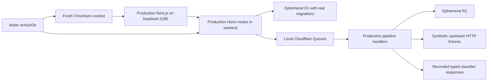

# Full-stack end-to-end testing

The primary suite contains **61 end-to-end tests** and uses [tester-army/e2e](https://github.com/tester-army/e2e), pinned to `e2e@0.17.0` and `@e2e-dev/web@0.12.0`. Tests use its browser fixtures, semantic locators, exact assertions, route fault injection, downloads and polling. No agent or language-model call decides whether a test passes.

## Run

Use Node 22.22.3+ on the 22.x line, or Node 24.8+, and pnpm 10.

```sh
pnpm install
pnpm exec e2e-web install chromium
pnpm test:e2e
```

On Linux CI, install system dependencies with `pnpm exec e2e-web install chromium --with-deps`.

```sh
# Run one feature independently, against a fresh database.
pnpm test:e2e tests/system/tenant-isolation.e2e.ts
# Inspect discovery without starting the application.
pnpm exec e2e list
# Faster local reruns after a successful web production build.
E2E_SKIP_BUILD=1 pnpm test:e2e tests/system/investigation.e2e.ts
```

The skip-build option is only for local iteration when frontend source has not changed. CI always builds. Run one suite per checkout: the browser server owns port 3180 and reports share `.e2e/`. It refuses to adopt an existing server. Development on port 3000 can continue, but avoid concurrent Next builds/dev in the same checkout because they share `.next`.

## Isolation and execution



`scripts/e2e-server.ts` bundles a test-only Worker entry, applies every checked-in migration, seeds explicitly synthetic global intelligence and starts the production web app. Miniflare state is in memory; it never opens `.wrangler` persistence or deployed resources. The local runtime uses compatibility date `2026-08-06`, matching the installed workerd binary, while deployment retains its separately configured date.

Each test provisions a fresh tenant, hashed API key and assessment snapshots through a loopback-only, token-protected test control route. Browser tests exchange the key for a real application session. The frontend runs in production mode, so the development API-key bypass cannot hide authentication failures. Tests can be run individually without relying on earlier test decisions.

The test control routes exist only in `tests/system/support/worker.ts`; production Wrangler builds use `apps/api/src/index.ts`. Control credentials are generated per run, saved with mode 0600 under ignored `.e2e/runtime/`, and excluded from CI artifacts. The shared seed builder produces the same demo data for local bootstrap and isolated tests without touching development credentials.

Feed responses are intercepted at the Workers outbound boundary. Unexpected destinations fail closed. All fixtures are labelled synthetic and use reserved addresses/domains. The actual feed parsers, streaming MITRE import, normalisation, graph correlation, D1 outbox, queue handlers, R2 archive, classifier wrapper and export code execute. Only external intelligence services and the remote AI binding are substituted. Vectorize is disabled in this suite; candidate retrieval here exercises the intelligence graph.

## Coverage

| Suite                                   | Assertions                                                                                                                                                                                                                                                                                |
| --------------------------------------- | ----------------------------------------------------------------------------------------------------------------------------------------------------------------------------------------------------------------------------------------------------------------------------------------- |
| Authentication and security             | Sign-in failure/success, HttpOnly session persistence, logout, key revocation, scope enforcement, CSRF origin checks, non-cacheable API errors, malformed requests, graph-depth bounds                                                                                                    |
| Analyst investigations                  | Confirm/reject/investigate persisted and audited, review-queue state, modified decisions preserve model probabilities, real stale-edit conflicts preserve drafts, provenance and graph inspection, STIX download, forced reassessment, archived export isolation, missing record handling |
| Bulk pipeline                           | Paste/CSV/JSON/STIX uploads, real queue completion, duplicate normalisation, invalid-row isolation, oversized-upload rejection in both browser and API, processing across 100-row pages, concurrent idempotency, payload conflicts, retry after losing a committed submission's response  |
| Intelligence sources and classification | All six required feeds, R2 archive/checkpoints, canonical MISP aliases, ATT&CK candidate generation, behaviour gate, no forced attribution, full probabilities/model version, unchanged-evidence cache, Clef escalation for insufficient evidence, disabled feeds, classifier outage      |
| Threat operations                       | Server-backed filters, empty search recovery, pagination beyond 50 rows, empty tenant, assessment dialog validation and unknown outcome, search without unintended classification, recoverable API outage, inventory persistence, unknown cluster members                                 |
| Tenant isolation                        | Private assessment/observable/search/graph/STIX access, feedback isolation, job and replay protection, telemetry exclusion, SQL-shaped searches, stored markup rendering, invented actor/ATT&CK override rejection                                                                        |
| Responsive and keyboard UX              | Full-document sidebar rail, short viewport, dialog forward/reverse focus containment, Escape/focus restoration, mobile navigation, overflow checks for primary pages                                                                                                                      |

The eight additional Playwright regressions remain in `tests/e2e/` and run in CI as `pnpm test:playwright`, including timer-controlled polling behavior. Unit, repository, migration, classifier, adversarial-input and evaluation tests continue under `pnpm test` and `pnpm eval`.

## Reports and debugging

The runner emits `.e2e/report.json`, `.e2e/junit.xml` and `.e2e/summary.md`. Failed browser tests retain screenshots, screen snapshots and traces in `.e2e/artifacts/`; `.e2e/logs/app.log` contains startup and structured API/job logs. GitHub Actions uploads these diagnostics even when a test fails, but never uploads `.e2e/runtime/`.

Use the first failed assertion and its screen snapshot to distinguish an application defect from a locator mismatch. Locators in this framework match accessible names exactly by default; use a regular expression only when an intentional counter or changing label is part of that name. Use assertion polling for asynchronous completion, never fixed sleeps. Feed checks wait for the specific sync job to finalize, so an earlier healthy status cannot satisfy a new sync test.

Retries are disabled so regressions stay visible. Each tenant and browser context is independent. Global feed fixtures are shared within one run; feed-sync tests explicitly sync their own dependencies and assert the current job, not execution order. External services are never contacted by a test to repair missing state.

## Boundaries

These tests establish application behavior against the local Workers runtime. Recorded classifier probabilities are not measurements of Clef accuracy. They do not validate live provider availability/licensing, deployed Cloudflare configuration, Vectorize retrieval quality, actual OpenCTI delivery, TLS/Secure cookies, multiple browser engines, load capacity or statistical calibration. Those remain deployment acceptance or separate evaluation concerns. Mobile coverage is responsive Chromium, not a native mobile app or Safari certification.

## Account and team coverage

The suite uses real Better Auth sessions against ephemeral D1, with an email binding that captures messages in test-only R2. It exercises invitation → signup → email verification → acceptance, member roles, last-admin protection, resend/cancellation, password reset and revocation, toast feedback and mobile layout. Integration tests additionally prove wrong-recipient rejection, cross-tenant membership isolation, immediate authorization changes, atomic last-admin protection, single-use reset links and recoverable delivery failures. No test sends email or uses a deployed account.

To refresh account/team README images, run `UPDATE_SCREENSHOTS=1 pnpm test:e2e tests/system/team-access.e2e.ts`. These images use synthetic accounts only.

The offline Worker bundles with the same `workerd`/`worker` export conditions as Wrangler. This ensures Better Auth uses native AsyncLocalStorage instead of its single-request browser fallback. A concurrency regression validates parallel authenticated reads and sign-out against the real Worker runtime.
