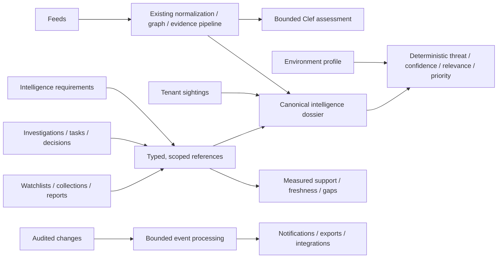

# Enterprise intelligence operations upgrade

## Architecture and repository review

The existing API is a Hono Worker with authenticated `/v1` routes, tenant-scoped repositories and Better Auth organization membership. Queue stage modules share a deployment artifact; D1 outbox records, leases and retries protect asynchronous ingestion. Raw feed responses and immutable STIX exports live in R2. Typed Clef decisions are constrained by graph candidates and behavioural gates. The Next.js/OpenNext application uses the API through a same-origin service binding. The Python OpenCTI connector consumes archived STIX bundles, advancing its cursor only after acceptance. These boundaries remain intact.

Existing migrations 0001–0008 cover canonical intelligence, source assertions, private observable grants, customer observations, assessments, review revisions, exports, authentication and personal triage views. They do not model requirements or collaborative analyst work. These belong in additive tenant-scoped operational tables, not a replacement graph. Existing full-stack tests exercise real local D1/Queues/R2 and recorded external responses; live acceptance remains a separate release step.

## Design

- Operational objects reference entities, evidence, assessments and other workspace objects; they do not copy intelligence or create source assertions.
- All private tables carry tenant scope. Ownership/collaborators are validated against current membership. API keys retain existing scopes; viewers cannot mutate analyst objects.
- Object revisions and append-only history commit atomically. Conflicting edits return 409 and preserve the analyst's draft.
- Coverage measures configured collection criteria with supporting records, not a probability that a question has been answered. Zero support and missing context are explicit gaps.
- Threat, confidence and customer relevance remain separate. Every contribution references a structured field or evidence record. Policies are versioned heuristics, not statistically calibrated probabilities.
- Sightings describe observation, not maliciousness. Tenant observations cannot become public evidence through a watchlist, graph pivot, report or export.
- Publication requires explicit access and redistribution policy. No integration follows URLs from intelligence text. No action autonomously blocks infrastructure.
- The interface uses flat, dense tables and dossiers, Geist at 13–14px, readable metadata and small radii. Existing routes remain valid.

## Delivery and acceptance

1. Add operational schemas, migration, scoped repositories and atomic history.
2. Implement requirements, investigations, watchlists, collections, reports and sightings through API and analyst UI.
3. Expand dossiers, context, explainable scoring, source quality, graph and timeline.
4. Add distribution and bounded automation using existing pipeline primitives.
5. Exercise tenant boundaries, stale writes, references, exports, prompt-injection boundaries and browser workflows; update README screenshots and deploy additive changes.

The implementation and validation record will distinguish implemented capabilities from operational prerequisites. A functioning UI is not proof of classifier calibration, live feed accuracy or external integration delivery.

## Implemented release

Operational schemas and migrations, requirements, investigations, watchlists, collections, authored reports, sightings, canonical dossiers, deterministic scoring, source ratings/policy, graph filters/pivots/paths, timelines, command search, queued matching, bounded playbooks, webhook delivery, TAXII publication/import, MISP exchange and optional OpenCTI collection delivery are implemented. See [intelligence operations](intelligence-operations.md) for exact behavior and bounds.

The upgrade preserves Better Auth teams, Clef question sets, global/customer separation, normalization identities, existing assessment APIs, outbox leases, queue retries, archive storage and the OpenCTI helper. It introduces no replacement database, orchestration platform or conversational model interface.

## Validation record — 2026-10-06

- 80 offline unit/integration tests and 84 isolated full-stack E2E tests passed, including tenant isolation, revision conflicts, private sightings, automation redelivery, tag privacy, TAXII pagination and report escaping.
- All 8 existing Playwright browser regressions passed. All 23 captured screenshots are embedded in the README.
- Four offline OpenCTI delivery tests verify page acceptance, retained export state, failed-delivery recovery, unchanged snapshots and repeated-token rejection.
- Lint, strict TypeScript, production builds, repository security checks, dependency audit and evaluation-fixture self-check passed. Fixture scores are not measured classifier accuracy.
- Cloudflare migrations 0009–0014 applied after recording a D1 recovery bookmark. API version `d79d80fe-9ea1-4b7e-916c-1a99f2ae58ec` and web version `9cd42f44-450d-4f47-a327-45142e5202ee` deployed successfully.
- Production health/readiness, all six workspace modules, sightings, notifications, integration configuration, source ratings, membership, TAXII discovery, existing assessments and an existing entity dossier returned 200 with the authorized API key. Anonymous requirements access returned 401. Web sign-in returned 200. No demo seed was applied to production.

Webhook receiver delivery and the optional OpenCTI collection consumer are tested offline, not claimed as live downstream acceptance. Source/model calibration, SSO, retention and load acceptance remain explicit deployment work.
